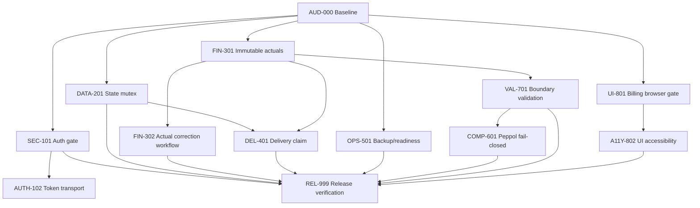

# Aftergraph Billing — Audit Remediation Task Graph

Status date: 2026-09-13  
Canonical repository: Aftergraph/studio  
Worktree: /root/workspace/aftergraph/studio-billing-audit  
Base SHA: 11eeb75e9ffd3db330ca8b4e609cd71e3f1d8c4a  
Remote head: feature/billing-workflow-v1 = 11eeb75e9ffd3db330ca8b4e609cd71e3f1d8c4a  
PR: #55 OPEN — never merge as part of this loop

This file is the execution board for the remediation work found in AUDIT_REPORT.md. IDs are stable. Every task must end with changed paths, focused evidence, full regression evidence, residual risk and the next dependency. No task may silently expand into deployment, force-push, merge, credential changes or unrelated cleanup.

## Operating contract

Priority:

- P0 = release blocker; security, financial integrity or recovery.
- P1 = required before a credible production-readiness claim.
- P2 = important hardening or quality improvement after P0/P1.

State:

- DONE = independently evidenced at the canonical SHA.
- READY = scope and acceptance criteria are clear; safe to start.
- ACTIVE = currently being implemented.
- LOCKED = dependency not complete.
- BLOCKED = external evidence/approval/authority missing.
- PARKED = intentionally deferred after risk review.

Execution rules:

1. One coherent slice at a time when files overlap.
2. TDD: write a failing regression test, implement the smallest fix, run focused tests, inspect diff.
3. Do not accept green text without exact observable evidence.
4. Stop on unexpected worktree changes, failing unrelated tests or contract ambiguity.
5. Local code changes are allowed in the audit worktree only. No work in /root/workspace/aftergraph/studio.
6. Production restart, deployment, backup repair on VDS, GitHub issue/PR metadata mutation and merge are protected actions.
7. PR #55 remains open and must never be merged.

## Dependency graph

## Task board

### P0 — security, financial integrity and recoverability

| Sort | ID | Task | Scope / files | Acceptance evidence | Depends | State |
|---:|---|---|---|---|---|---|
| 0 | AUD-000 | Freeze audit baseline | AUDIT_REPORT.md, exact SHA, PR #55 | SHA, remote head, PR state and worktree provenance recorded | — | DONE |
| 1 | SEC-101 | Close unauthenticated magic-link issuance | server/app-server.mjs; auth tests | No bearer/valid challenge cannot issue a token; actor in request body is not authentication; replay/unknown-user/rate-limit tests pass | AUD-000 | DONE — 26 auth/server tests pass; final exact-head evidence recorded in PR #55 |
| 2 | DATA-201 | Serialize state mutations | src/server-store.mjs; store tests | Concurrent increments and invoice sequence preserve both writes; persistence remains atomic; focused and full tests pass | AUD-000 | DONE — 2 concurrency tests + server tests pass; final exact-head evidence recorded in PR #55 |
| 3 | FIN-301 | Make actual evidence immutable/conflict-safe | src/billing/mutations.mjs; server/billing-server.mjs; Billing tests | Existing actuals cannot be silently replaced; conflicts fail closed; canonical actual metadata remains unchanged after rejection | AUD-000 | DONE — 15 Billing API tests pass; final exact-head evidence recorded in PR #55 |
| 4 | DEL-401 | Make delivery claim exclusive and idempotent | server/billing-delivery.mjs; src/billing/mutations.mjs; delivery tests | Concurrent distinct requests produce one provider attempt; pending claims return 409; provider receives stable attempt/provider idempotency identity; failed attempts remain retryable | DATA-201, FIN-301 | DONE — 24 delivery/API tests pass; final exact-head evidence recorded in PR #55 |
| 5 | OPS-501 | Repair backup and readiness truthfulness | scripts/state_backup.mjs; deploy units; readiness tests; VDS evidence | Real production backup exists, restore drill passes, freshness is observable, readiness cannot be green with stale/failed backup | AUD-000 | BLOCKED: production operations approval/evidence |
| 5.1 | OPS-502 | Make backup evidence observable and checksum-verified | scripts/state_backup.mjs; server/app-server.mjs; deploy/studio-backend.service; backup tests | `state:verify` validates every manifest file; `/readyz` is 503 for missing/stale/invalid backup and 200 only for fresh verified evidence | OPS-501 | DONE — focused backup/readyz tests pass; production backup evidence still required by OPS-501 |
 
### P1 — compliance, validation and proof

| Sort | ID | Task | Scope / files | Acceptance evidence | Depends | State |
|---:|---|---|---|---|---|---|
| 6 | FIN-302 | Add governed actual correction workflow | src/billing/mutations.mjs; server/billing-server.mjs; src/billing/browser-client.mjs; src/billing/billing-app.mjs; capability and Billing tests | Correction requires explicit actor, dedicated `billing.actuals.correct` permission, non-empty bounded reason, immutable audit event, replay-safe correction identity, and rejection after active invoice binding; UI exposes a reasoned correction dialog and client route | FIN-301 | DONE — 18/18 Billing API, 5/5 browser-client, 13/13 UI-contract tests pass; final exact-head evidence recorded in PR #55 |
| 7 | VAL-701 | Harden Billing/source boundary validation | src/billing/mutations.mjs; src/billing/source-sync.mjs; source/Billing tests | Impossible dates, duplicate IDs, invalid schedules/currency and negative terms are rejected with typed errors; UI cannot crash on malformed currency | FIN-301 | DONE — source suite 17/17 pass; final exact-head evidence recorded in PR #55 |
| 8 | COMP-601 | Enforce Peppol validator contract | src/billing/document-profile.mjs; server/billing-server.mjs; server.mjs; API tests | Missing external validator fails closed; configured validator result is required; no false 200 compliance export | VAL-701 | BLOCKED — fail-closed guard + 17 Billing API tests pass; production validator contract/config authority missing |
| 8.1 | COMP-602 | Add governed runtime validator adapter | server/billing-document-validator.mjs; server.mjs; docs/PRODUCTION.md; validator tests | HTTPS-only env adapter posts aftergraph.billing.validator.v1; timeout/malformed/non-2xx responses fail closed; tenant data cannot select endpoint | COMP-601 | DONE — adapter and Billing API focused tests pass; production authority/config still required by COMP-601 |
| 9 | UI-801 | Add real Billing production browser-QA gate | Billing browser harness, test scripts, CI/release verification | Reachable production route proves auth/source/Ready/draft/issue/PDF/delivery/offline/reconnect/390px/no overflow/no errors at exact SHA | AUD-000 | DONE — fresh production tenant QA PASS: route/auth/source/Ready/draft/issue/PDF/Peppol/delivery/invoiced/mobile/offline/cold reload/reconnect/no errors |
| 10 | A11Y-802 | Close Billing UI accessibility gaps | billing/index.html; src/billing/billing-app.mjs; styles/billing.css/tokens.css; UI tests; VDS axe harness | Correct tabs or buttons, keyboard behavior, focus return, 44px targets, contrast >=4.5:1, offline semantics and axe evidence | UI-801 | DONE — fresh Billing axe WCAG 2.2 A/AA: 22 passes, 0 violations; UI contract 13/13; production browser-QA PASS |
| 11 | SUP-901 | Restore dependency reproducibility | package.json; package-lock.json; CI | Lockfile committed, `npm ci --dry-run` and `npm audit --omit=dev` pass; supported Node version is documented | AUD-000 | DONE — lockfile generated; npm ci dry-run and audit 0 vulnerabilities |
 
### P2 — residual hardening and release

| Sort | ID | Task | Scope / files | Acceptance evidence | Depends | State |
|---:|---|---|---|---|---|---|
| 12 | AUTH-102 | Migrate bearer storage away from localStorage | auth transport, bootstrap, Billing client, auth tests/docs | Short-lived HttpOnly/Secure/SameSite session or reviewed memory-only token path; XSS token exfiltration risk reduced | SEC-101 | PARKED until auth flow is stable |
| 13 | UX-803 | Improve coded error recovery and dialog focus | src/billing/billing-app.mjs; styles/billing.css; UI tests | Inline field/form errors, aria-describedby, trigger-focus restoration, Escape/backdrop paths | A11Y-802 | DONE — inline error targets plus focus/Escape handling; UI contract 13/13 pass; fresh browser-QA and axe rerun pass |
| 14 | REL-999 | Final exact-head release verification | all local gates, VDS, GitHub checks, PR evidence | All required local gates pass; final SHA equals local/remote/PR; CI and aggregate CodeQL success; PR stays OPEN and unmerged | SEC-101, DATA-201, FIN-301, FIN-302, DEL-401, OPS-501, COMP-601, VAL-701, A11Y-802, SUP-901 | BLOCKED — exact-head CI/CodeQL PASS; OPS-501 and COMP-601 remain external release blockers |

## Verification checkpoint (2026-09-13, final remediation candidate)

- Source suite: **17/17 PASS**.
- All Billing tests: **114/114 PASS**.
- Full `npm test`: **780/780 PASS**.
- Fresh production tenant browser-QA: **PASS**.
- Fresh Billing axe WCAG 2.2 A/AA: **22 passes, 0 violations**.
- `npm run verify:secrets`: **PASS**.
- `git diff --check`: **PASS**.
- `node scripts/v6_release_verify.mjs`: **49/49 PASS**.
- `npm run verify`: **PASS**.
- Dependency reproducibility: `npm ci --ignore-scripts --no-audit --dry-run` PASS; `npm audit --omit=dev` reports 0 vulnerabilities.
- OPS-502 backup freshness/checksum/readiness tests: **PASS**.
- COMP-602 runtime validator adapter/API tests: **PASS**.
- Generated screenshots/performance output were restored and are excluded from the remediation scope.
- External blockers remain: OPS-501 production backup evidence and COMP-601 validator contract/config. Exact-head CI/CodeQL and PR evidence must be rerun for the new feature SHA before release.

## Execution loop

Each active task follows this loop:

1. **Diagnose:** inspect current exact SHA and task-specific code path.
2. **Specify:** write the smallest executable acceptance test.
3. **Red:** prove the test fails for the intended reason.
4. **Fix:** make the smallest coherent patch within the listed write set.
5. **Green:** run focused tests and inspect the diff.
6. **Regression:** run all affected Billing/source tests.
7. **Record:** update this board with SHA, commands, result and residual risk.
8. **Promote:** unlock only the direct dependents; do not start unrelated work.
9. **Release gate:** REL-999 is the only path to a release decision.

## First implementation batch

The first batch is deliberately limited to four isolated, high-impact slices:

1. SEC-101 — auth gate
2. DATA-201 — state mutation serialization
3. FIN-301 — immutable actual evidence
4. SUP-901 — dependency reproducibility assessment

DEL-401 cannot start until DATA-201 and FIN-301 are complete because both touch the mutation boundary. OPS-501 and UI-801 remain separately blocked by production authority/network evidence.

## Stop conditions

Stop and report BLOCKED if:

- the worktree contains unexpected user/agent changes;
- the intended regression test does not fail before the patch;
- an existing invariant becomes weaker;
- a protected production/GitHub action is required;
- the VDS backup path, browser network path or validator authority remains unknown;
- local and remote exact SHA diverge unexpectedly.

## Completion definition

The task graph is complete only when:

- all P0 tasks are DONE with independent evidence;
- all P1 tasks are DONE or an explicit risk acceptance exists;
- REL-999 verifies exact local/remote/PR SHA;
- Studio CI and aggregate CodeQL are SUCCESS for that SHA;
- PR #55 remains OPEN and is not merged.
